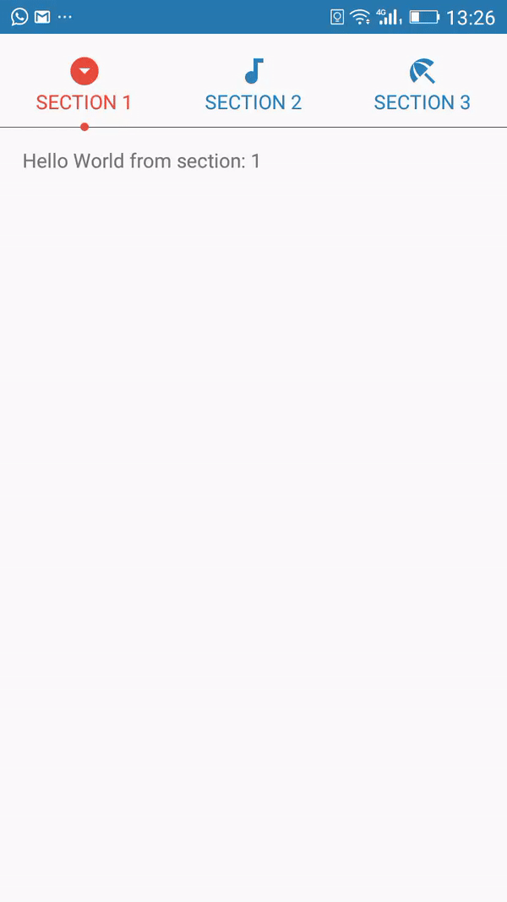

# CircularIndicatorTabLayout #
## Demo ##

## Example ##

`<np.com.ngimasherpa.citablayout.CircularIndicatorTabLayout  
        android:id="@+id/tab_monitoring_criteria"  
        android:layout_width="match_parent"  
        android:layout_height="@dimen/spacing_72"  
        app:iconColor="@color/colorPrimaryDark"  
        app:indicatorColor="@color/colorAccent"  
        app:indicatorPosition="bottom"  
        app:lineColor="@android:color/holo_red_dark"  
        app:lineEnabled="true"  
        app:mode="fixed"  
        app:selectedIconColor="@color/colorAccent"  
        app:tabViewIconId="@+id/iconTabViewLayout"  
        app:tabViewLayoutId="@layout/tab_layout"  
        app:tabViewTextViewColor="@color/colorPrimaryDark"  
        app:tabViewTextViewId="@+id/textTabViewLayout"  
        app:tabViewTextViewSelectedColor="@color/colorAccent"  
        app:tab_gravity="fill" />`